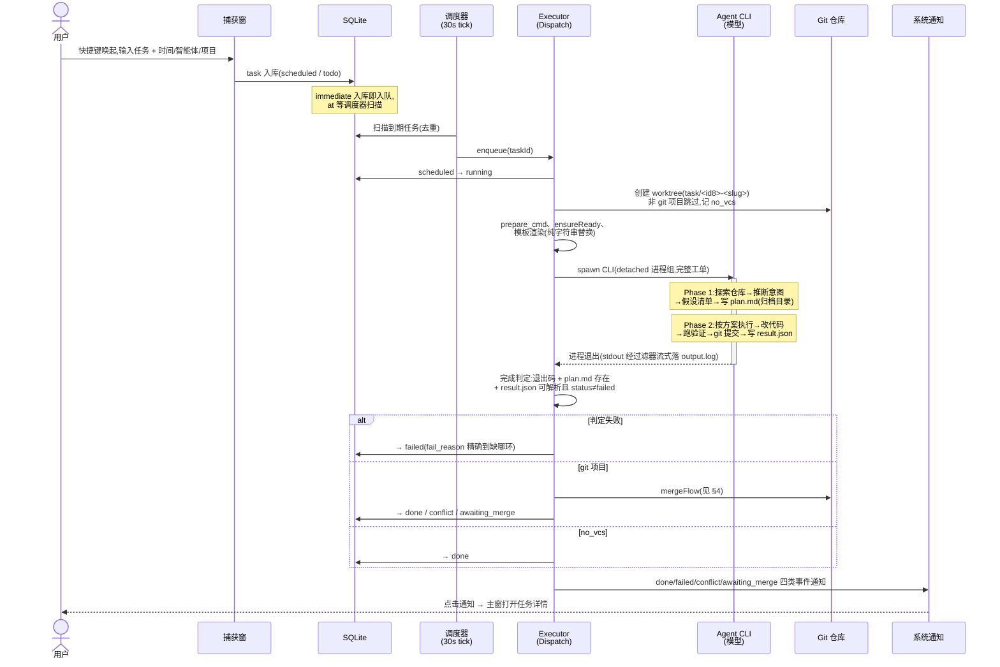
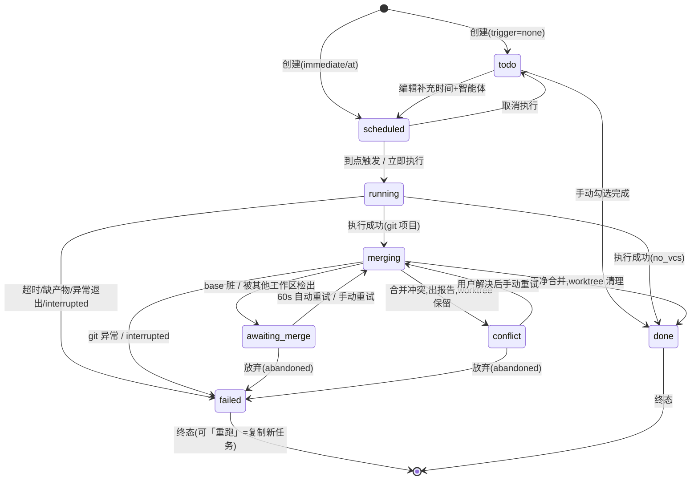
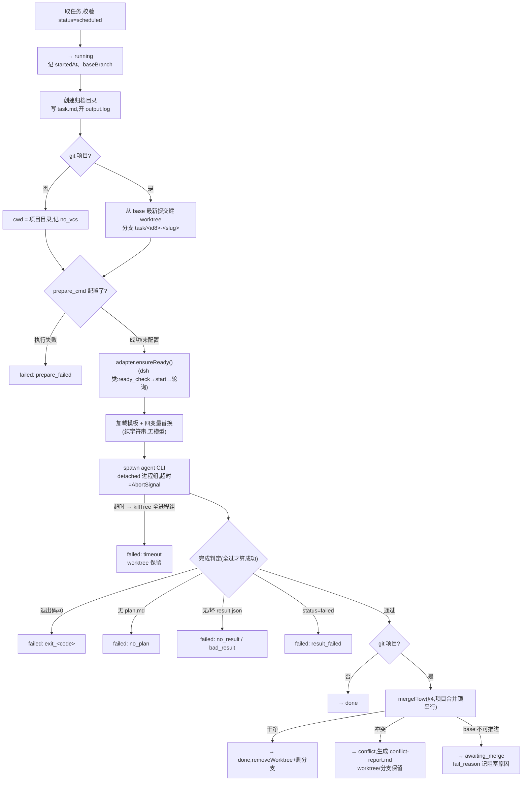
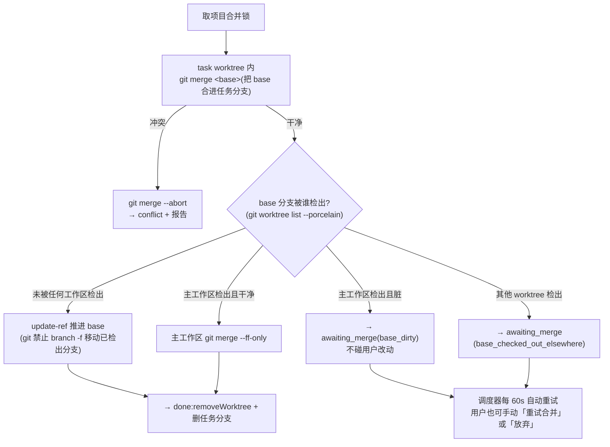
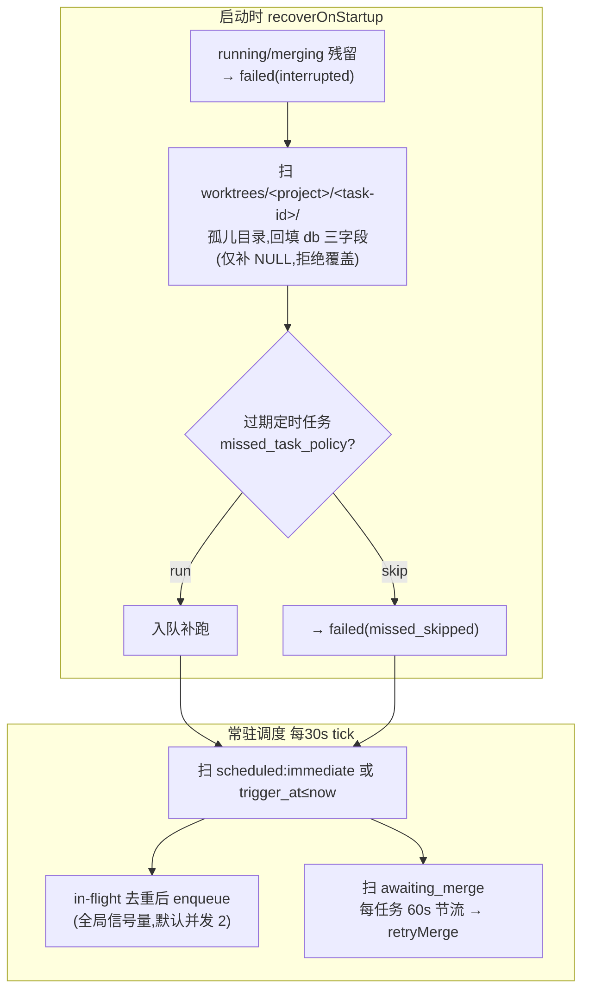
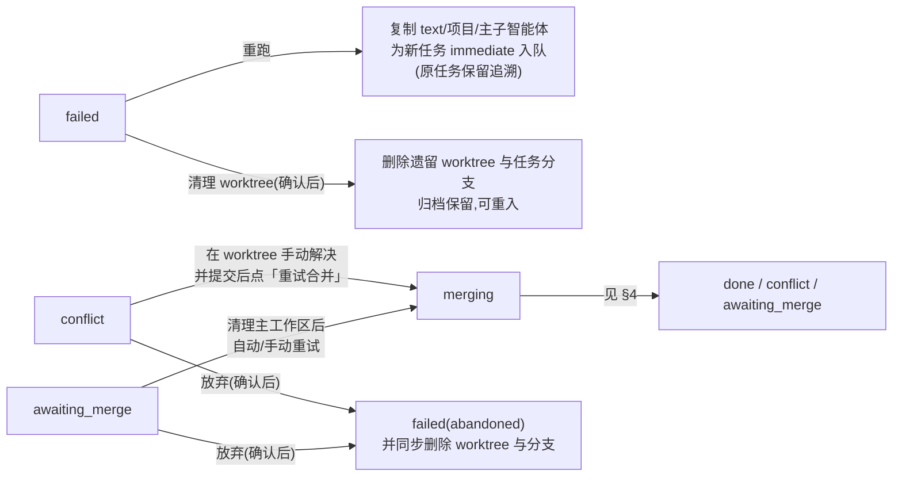
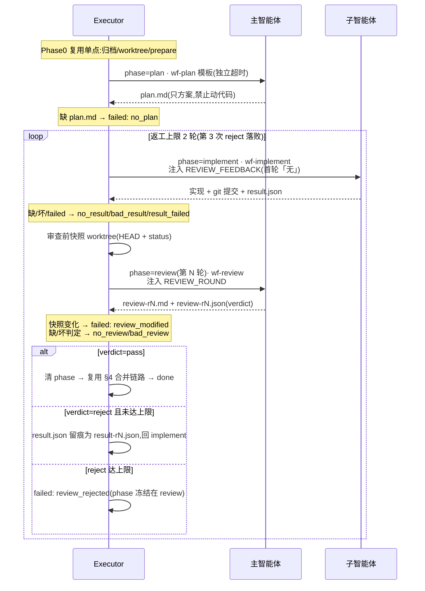

# Dispatch 业务流程图

> 状态:有效(现行事实,与 main 分支实现一致,2026-08-22 第二次核对:含工作流模式与清理闭环)
> 依据实现:`src/shared/state-machine.ts`、`src/core/executor/`(含 `workflow.ts`)、`src/core/gitops/`、`src/core/scheduler/`、`src/shell/`。改流程必须同步改本文档。

## 1. 端到端全景:一条任务的一生

关键分工:**实线框 = Dispatch 确定性代码(零模型调用);双线框 = agent CLI 内的模型行为**。「任务变方案」发生在 agent CLI 的 Phase 1,不是 Dispatch。

## 2. 任务状态机

与 `src/shared/state-machine.ts` 的 TRANSITIONS 逐边一致;所有状态写入经 `TaskStore.transition()` 校验,非法迁移直接抛错。

工作流模式**不增加状态**:三段接力全程处于 `running`,进度经展示性 `phase` 字段(plan/implement/review,仅 `TaskStore.setPhase` 可写)表达;失败时 phase 冻结在末阶段供追溯,仅审查通过离开 running 前清空。

## 3. 单任务执行流程(runTask)

`runTask` 按 `sub_agent` 是否为空分流:空 = 下图单点路径;非空 = §7 工作流编排(Phase0/完成判定/合并链路与单点共用同一批函数)。

## 4. 合并流程(mergeFlow,spec §7.3 + dev-plan §0 修正 2)

全程在 task worktree 内与 ref 层操作,**绝不改写用户主工作区内容**。

## 5. 调度与崩溃恢复

## 6. 用户干预操作流

worktree 清理策略:done 在合并链路内即时清理;放弃即清理;failed 保留供排查、经「清理 worktree」手动回收(超期批量提示为 B4 待办);conflict/awaiting_merge 拒绝清理——worktree 是重试合并的前提。

## 7. 工作流模式(主智能体方案 → 子智能体实现 → 主智能体审查)

捕获时选了子智能体即进入本编排(`src/core/executor/workflow.ts`);未选 = §3 单点路径零变化。三段提示词模板 `wf-plan / wf-implement / wf-review` 与编排代码逐段同步。

工作流新增 fail_reason:`timeout_plan / timeout_implement / timeout_review / no_plan / no_review / bad_review / review_modified / review_rejected / agent_not_ready`。`reviewRound` 语义:implement 阶段 = 已完成审查数(首轮 0);review 阶段 = 当前审查轮次(从 1 起)。

## 已知边角(与图的偏差点)

1. `missed_task_policy=skip` 实际走 scheduled→running→failed 两步(状态机无直达边),UI 会闪一下「执行中」。
2. conflict worktree 内手动 merge 未提交(MERGE_HEAD 残留)时点重试 → failed(merge_retry),只能重跑;数据不丢。
3. 睡眠唤醒依赖 setInterval 自然补扫,无 powerMonitor 特判;关机错过的任务走 §5 的 missed 策略。
